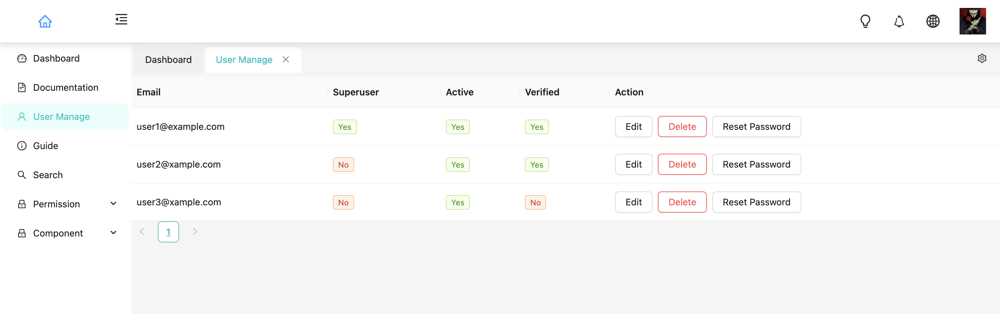
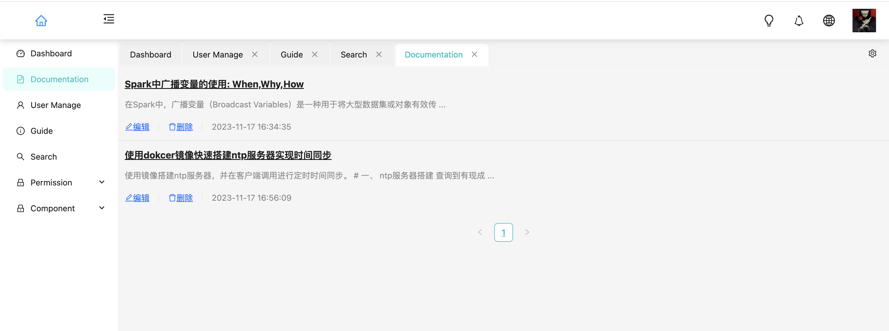

English | [简体中文](./README.zh_CN.md)

<h1 align="center">React Antd IP Admin</h1>

<div align="center">

The best practices for React Hooks with Antd and Typescript.

<a href="https://github.com/facebook/react">
  
</a>
<a href="https://github.com/ant-design/ant-design">
  
</a>
<a href="https://github.com/microsoft/TypeScript" rel="nofollow">
  
</a>
<a href="https://github.com/reduxjs/redux" rel="nofollow">
  
</a>
<a href="https://github.com/WinmezzZ/react-antd-admin/blob/master/LICENSE">
  
</a>

</div>

## Preview
The project utilizes **miragejs** to intercept and mock all API interface data. You can easily run and debug in the development environment to observe the display effects.




## ✨ Features

- 💡 **TypeScript**: A language for application-scale JavaScript
- 📜 **Blocks**: Build page with block template
- 💎 **Hooks**: Use react hooks API instead of traditional class API
- 📐 **Common Templates**: Typical templates for enterprise applications
- 🚀 **State of The Art Development**: Newest development stack of React/hooks/Redux/antd/typescript
- 📱 **Responsive**: Designed for variable screen sizes
- 🎨 **Theming**: Dynamically switch system theme
- 🌐 **International**: Built-in i18n solution
- ⚙️ **Best Practices**: Solid workflow to make your code healthy
- 🔢 **Mock development**: Easy to use mock development solution
- ✅ **Usage**: No barriers to use with complete documentation and detailed comments
- 🔐 Permission Management: Implement robust permission management to control access and maintain security.
- 📝 Markdown Support: Integrated with react-markdown-editor-lite for rich markdown editing capabilities.

## 📦 Install

```bash
$ git clone https://github.com/ayueaa/react-antd-ip-admin.git
$ cd react-antd-ip-admin

# npm
$ npm install
$ npm start

# yarn
$ yarn install
$ yarn start
```

## 🔨 Build

```bash
# npm
$ npm install
$ npm run build

# yarn
$ yarn install
$ yarn start
```

This project default deploy on root site, if you want to deploy on a child site, you need to set the public path. In the `.env` file at the root of this project, add `PUBLIC_URL=YOUR_CHILD_PATH`.


## 🤝 Contributing

We very much welcome your contribution, you can build together with us in the following ways 😃

- Use Ant Design Pro in your daily work.
- Submit GitHub issues to report bugs or ask questions.
