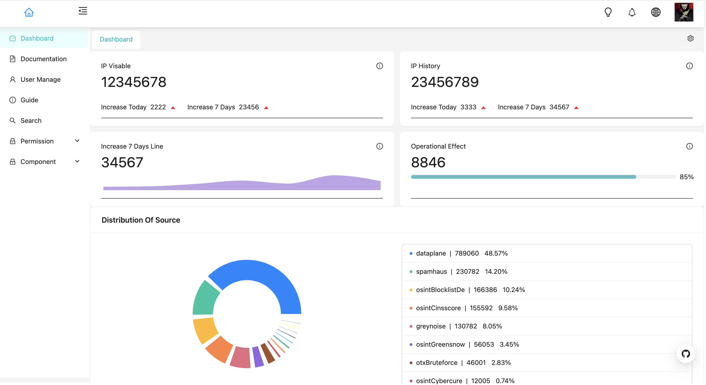

[English](./README.md) | 简体中文


<h1 align="center">React Antd IP Admin</h1>

<div align="center">

React Hooks + Typescript 最佳实践。

<a href="https://github.com/facebook/react">
  
</a>
<a href="https://github.com/ant-design/ant-design">
  
</a>
<a href="https://github.com/microsoft/TypeScript" rel="nofollow">
  
</a>
<a href="https://github.com/reduxjs/redux" rel="nofollow">
  
</a>
<a href="https://github.com/WinmezzZ/react-antd-admin/blob/master/LICENSE">
  
</a>

</div>

## Preview



## ✨ 特性

- 💡 **TypeScript**: 应用程序级 JavaScript 的语言
- 📜 **区块**: 通过区块模板快速构建页面
- 💎 **Hooks**: 使用最新的 react hooks API 代替传统的 class API
- 📐 **常见设计模式**: 提炼自中后台应用的典型页面和场景
- 🚀 **最新技术栈**: 使用 React/hooks/Redux/antd/typescript 等前端前沿技术开发
- 📱 **响应式**: 针对不同屏幕大小设计
- 🎨 **主题**: 动态切换主题色
- 🌐 **国际化**: 内建业界通用的国际化方案
- ⚙️ **最佳实践**: 良好的工程实践助您持续产出高质量代码
- 🔢 **Mock 数据**: 实用的本地数据调试方案
- ✅ **使用**: 完整的文档和详细的注释，无阻碍使用
- 🔐 **权限管理**: 实现登录用户管理及路由权限管理
- 📝 **Markdown 支持**: 使用react-markdown-editor-lite 支持富文本内容的增删改查页面

## 📦 下载

```bash
$ git clone https://github.com/ayueaa/react-antd-ip-admin.git
$ cd react-antd-ip-admin

$ npm install
$ npm start
```

## 🔨 构建

```bash
npm install
npm run build
```

此项目默认部署在根站点上，如果要部署在子站点上，则需要设置公共路径，在本项目根目录下的 `.env` 文件中添加 `PUBLIC_URL=YOUR_CHILD_PATH`。


## 🤝 贡献

我们非常欢迎您的贡献，您可以通过以下方式与我们共建 😃

- 在你的公司或个人项目中使用 React Antd Admin
- 通过 GitHub issues 报告 bug 或进行咨询。
